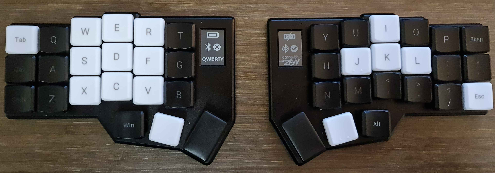
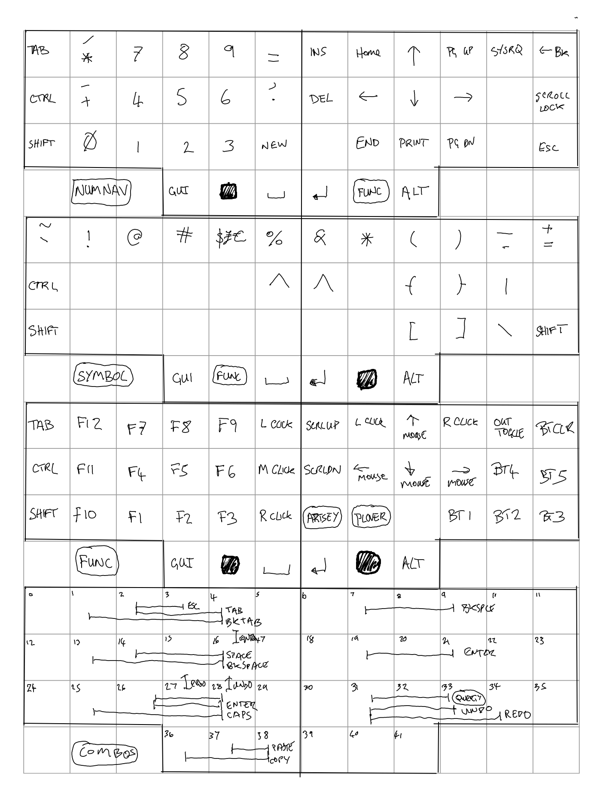

# Corne-ish Zen V2 Custom Configuration

This is based on the [zmk-config-Corne-ish-Zen](https://github.com/LOWPROKB/zmk-config-Corne-ish-Zen) repository.

## Resources

- The [caksoylar/zmk](https://github.com/caksoylar/zmk/tree/caksoylar/zen-v1+v2+experimental) fork of ZMK Firmware. This contains screen improvements and mouse keys.
- The [official ZMK Firmware GitHub](https://github.com/zmkfirmware/zmk) repository. View the keymaps for other boards and shields as a starting point for your keymap.
- The [official ZMK Documentation](https://zmk.dev/docs) web site. Find the answers to many of your questions about ZMK Firmware.
- The [official ZMK Discord Server](https://zmk.dev/community/discord/invite). Instant conversations with other ZMK developers and users. Great technical resource!

## Image

## Philosophy

The keymap should include every key from a normal keyboard that I ever use. For example, it needs to include caps lock since if your computer has capslock on but the keyboard doesn't have a way to turn caps lock off then you're a bit stuck.

Generally speaking, it shouldn't be difficult for someone to sit down and pick it up based on labels, memory, experiment and color clues. To that end, I want to keep lots of things clearly inspired by a typical keyboard. That being said, I'm using numbers inspired by the numpad rather than the number row, and I've switched some symbols around to make them easier to remember, especially the brackets as they are important for programming.

It should be a drop in replacement for a typical keyboard. I don't want to have to do customization on the computers I connect it to.

The left hand pad will be used a lot with the mouse on the right hand, so there are some combos for keys likely to be used with the mouse.

Where I'm considering trying something unusual, or am not sure exactly how I will want to use it, I'm not afraid of including multiple keys for the same thing so that I can try them out and see what works best. I like having the 0 key in two places.

## Roads not taken

I tried some momentary tap layers, but I was too likely to trigger them due to bad keying and being in the wrong layer is pretty annoying, so I've switched back to momentary layers.

I originally had a tap dance for shift to caps lock, but hammering shift is an important intellij shortcut so I've removed it.

## Changes from the original

Layers are qwerty, number/navigation, symbols, function/mouse/bluetooth, and then artsey layers for the left hand. The artsey layers are an experiment.

I've added pound and euro as tap dances to the dollar key. This is done via a unicode macro and so will only work on linux until OS_LEAD and OS_TRAIL are defined for windows / mac.

Shift backspace deletes.

